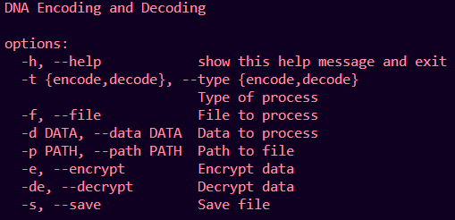
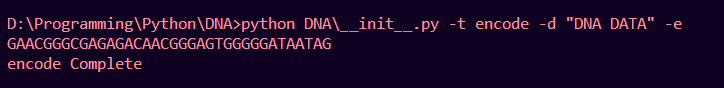
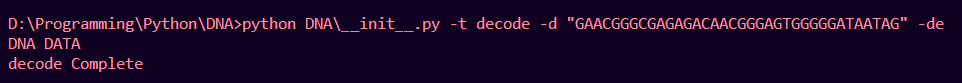

# ✨ DNA Data Encoder and Decoder ✨

<br>

## Hey there👋, I'm Mohak, and here's How this DNA Data Encoder and Decoder works :heart:.

### Before we begin, I'd like to tell you this,

<br>

> You've perfect knowledege of your shortcomings, and imperfect knowledge of their acievements, don't compare yourself yet.

<br>

#### Logic behind the scenes...

Well, DNA is made of 4 base molecules coded as `A G C T` and what can represent these 4 codes the best? The Answer is 2-bit Binary Codes i.e. `00 01 10 11` 

For the sake of this Implementation we are gonna encode and decode string objects only. PS, All the code you'll see is written in Python.

And to make things more interesting we are going to use Data encryption algorithm designed by me to secure our precious data.

```py
def encrypt(self, s):
        import random
        l = len(s)
        r = random.randint(1, l)
        return ''.join(chr(ord(c) + r + i) for i, c in enumerate(s[::-1]))+str(r)

def decrypt(self, s):
        r = int(s[-1])
        return ''.join(chr(ord(c) - r - i) for i, c in enumerate(s))[::-1][1:]
```

##### Representation of DNA codes into 2-bit binary is as follows

```
00 <-> A
01 <-> G
10 <-> C
11 <-> T
```

```py
DNA_encoding = {
            "00": "A",
            "01": "G",
            "10": "C",
            "11": "T"
        } 
DNA_decoding = {
            "A": "00",
            "G": "01",
            "C": "10",
            "T": "11"
        }
```

##### How the String Object is Encoded to DNA codes?

- First step is to convert the string to 2-bit binary format. Follow is how its done:
  ```py
  self.binary_str = ''.join(format(x, '08b') for x in bytearray(self.data, 'utf-8'))
  ```
- Then, we saperate the byte string to the corrosponding 2-bits 
- Now, it's time to map each binary code to DNA code.
  ```py
  def Encoding(self):
        binary_list = [self.binary_str[i: i+2] for i in range(0, len(self.binary_str), 2)]
        DNA_encoding = {
            "00": "A",
            "01": "G",
            "10": "C",
            "11": "T"
        } 
        DNA_list = []
        for num in binary_list:
            for key in list(DNA_encoding.keys()):
                if num == key:
                    DNA_list.append(DNA_encoding.get(key))
        return "".join(DNA_list)
  ```

##### Now, How it will be Decoded?
- Just Do all the steps done above in the reverse order.
  ```py
  def Decoding(self):
        DNA_decoding = {
            "A": "00",
            "G": "01",
            "C": "10",
            "T": "11"
        }
        Decoded_list = []
        for letter in self.data:
            for key in list(DNA_decoding.keys()):
                if letter == key:
                    Decoded_list.append(DNA_decoding.get(key))
        Decoded_str = "".join(Decoded_list)
        Decoded_str = "".join(chr(int(Decoded_str[i*8:i*8+8],2)) for i in range(len(Decoded_str)//8))

        return Decoded_str
  ```

### Well Thats All for Logical Part...

<br>

## USAGE of this Implementation:

It is a CLI based implementation. It has two modes `encode` and `decode` with optional arguements that does `encryption` and `decryption` and also can `save` the output in a file.



### Arguements:

- `-t` or `--type` specify the Type of mode `encode` or `decode`
  ```bash
  DNA -t/--type <encode/decode>
  ```
- `-f` or `--file` boolean flag to specify if theres a file to process.
  ```bash
  DNA -t/--type <encode/decode> -f/--file
  ```
- `-d` or `--data` Flag after with Data to process will be passed only if theres no file.
  ```bash
  DNA -t/--type <encode/decode> -d/--data <String>
  ```
- `-p` or `--path` specify the file path if the file flag passed
  ```bash
  DNA -t/--type <encode/decode> -f/--file -p/--path <File Path>
  ```
- `-e` or `--encrypt` to enable data encryption
  ```bash
  DNA -t/--type <encode/decode> -d/--data <String> -e/--encrypt
  ```
- `-de` or `--decrypt` to enable data decryption if the data was previously encrpted
  ```bash
  DNA -t/--type <encode/decode> -d/--data <String> -de/--decrypt
  ```
- `-s` or `--save` to save the output as a file
  ```bash
  DNA -t/--type <encode/decode> -d/--data <String> -e/--encrypt -s/--save
  ```
###### Encoding Example

###### Decoding Example


